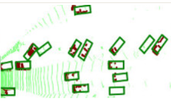

# Bird's-Eye-View

## Introduction

Autonomous driving is a geometric problem, where the goal is to navigate a vehicle safely and correctly. As such, an orthographic bird’s-eye view perspective is commonly used for motion planning and prediction. Autonomous vehicles (AV) typically refer to transport systems that move without the need for human intervention. This is achieved by the AV’s capability to sense its environment and operate independently.

Environment Perception is a critical feature for autonomous vehicles as it provides details about the surrounding environment, such as the drivable areas with the distances, velocities, and obstacle detection. The vehicle should be able to detect and classify both stationary and movable objects in its surrounding area efficiently.

AVs are equipped with cameras and sensors at different positions used in the estimation of the current position of the vehicle and the vehicles and obstacles in its vicinity.

## Outline

[Requirments](#requirments)

[Dataset](#dataset)

[Depth Estimation](#depth-estimation)

[Conversion from Depth Map to Point Cloud](#conversion-from-depth-map-to-point-cloud)

[3D Object Detection](#3D-object-detection)

[Bird's Eye View](#bird's-eye-view)

[Results](#results)

## Requirments
## Dataset
## Pretrained Model for Depth Estimation
## Inference of Depth Estimation
## Conversion from Depth Map to Point Cloud
## 3D Object Detection
## Bird's Eye View
## Results

